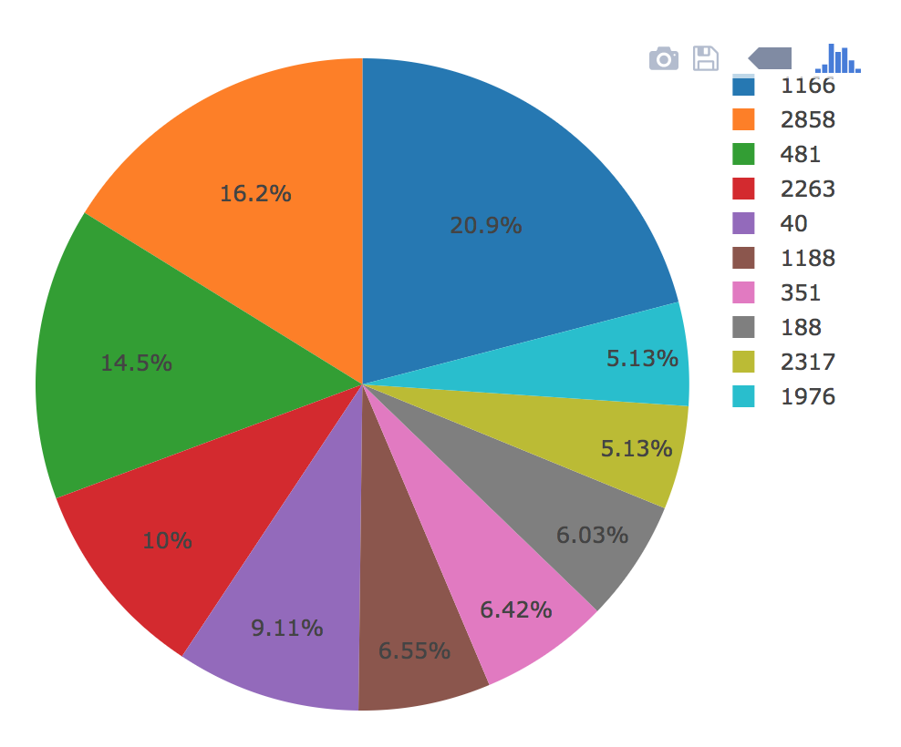

# Belly Button Biodiversity

Interactive dashboard to explore the [Belly Button Biodiversity DataSet](http://robdunnlab.com/projects/belly-button-biodiversity/).

## Plotly.js

Used to build interactive charts for your dashboard.

* PIE chart that uses data from samples route (`/samples/<sample>`) to display the top 10 samples.

  * `sample_values` as the values for the PIE chart

  * `otu_ids` as the labels for the pie chart

  * `otu_labels` as the hovertext for the chart

  

* Bubble Chart that uses data from samples route (`/samples/<sample>`) to display each sample.

  * `otu_ids` for the x values

  * `sample_values` for the y values

  * `sample_values` for the marker size

  * `otu_ids` for the marker colors

  * `otu_labels` for the text values

  

* Display sample metadata from the route `/metadata/<sample>`

  * Display each key/value pair from metadata JSON object on the page

* Updates all of the plots any time that a new sample is selected.

## Heroku

Deploy Flask app to Heroku.

* Use sqlite file for the database.

- - -

## Advanced

* Adapt the Gauge Chart from <https://plot.ly/javascript/gauge-charts/> to plot the Weekly Washing Frequency obtained from the route `/wfreq/<sample>`

* Modify the example gauge code to account for values ranging from 0 - 9.

* Update the chart whenever a new sample is selected

- - -

## Flask API

Flask API to serve the data needed for your plots.
